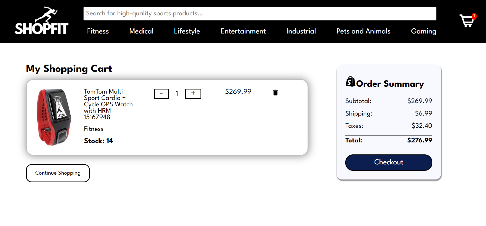

# ShopFit - Full Stack Web App

This was a project that I did with a partner as part of the Diploma of Full-Stack Web Development at Concordia University. We had 2 weeks to put together a full-stack e-commerce website, using React.js on the frontend, Node.js on the backend and MongoDB as the database.

Users are able to use a search bar to search products, as well as filter products based on price, category, body location and availability.  

  

  

  